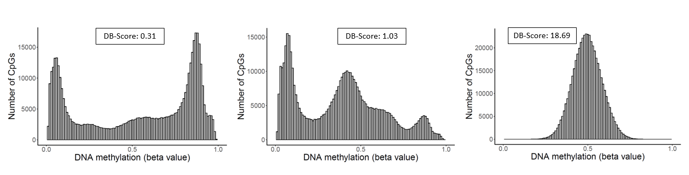
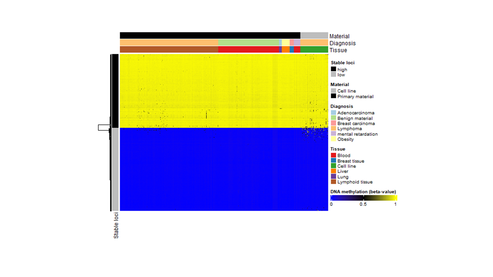

# DNAm-qc-scores

Here, we present three quality control scores (QC-Scores) for evaluating the quality of DNA methylation raw data from Illumina-based BeadChip arrays.  We suggest following cut-offs for the QC-Scores, which represent no biologically defined thresholds but are rather suggestions based on our experience.  

| QC-Score |     Cut-off          | Interpretation |
|:---------	|:------------------	|:---------------------|
| DB-Score 	| <1 		| A DB-Score above 1 indicates a deviation of the bimodal distribution of beta values and thus a technical problem or a possible biological background. |
| BIN-Score	| < 0.25 		| A BIN-Score above 0.25 is an indication of a technical error or a problem with the DNA itself. |
| CM-Score high and low | < 20% | Describe the percentage of deviant CpGs within the stable methylated loci and indicates a technical error or a problem with the DNA itself. |
| CM-Score difference | < 20% | Describes the differences between the HL-Scores high and low. A high difference is a measurement of a possible meaningful background. |

## DB-Score
In order to identify samples with a doubtful quality we mathematically summarized the overall DNA methylation distribution in the so called Distribution-Score. Therefore, the number of CpGs with beta values between 0.3 and 0.7 is divided by the number of CpGs with beta values smaller or equal 0.3 and higher or equal 0.7. The DB-Score can be calculated using the db.score() function.

**Figure Histograms:** Outstanding examples of samples with good (left), doubtful (middle) and bad (right) quality based on their DB-Scores.

>db.score(input)
>- input: Name of the table including one column with the TargetID followed by the beta values (samples are listed per column)
>
### Example
db.score(input = data)

## BIN-Score
To differentiate between those cases which technical failed from those with possible meaningful biological effects we implemented another quality score named bin distance score (BIN-Score). As basis for the calculation of the BIN-Score the R-package conumee is used, which enables copy number variation calling based on DNA methylation data. Thereby, the genome is segmented into fragments termed bins, each delineated by a specified minimum size and a requisite minimum number of CpGs. These bins, represented as points in the plot, serve to visually capture gains and deletions across the entire genome, shifting the segment line to the positive (gain) or negative (loss) along the y-axis. It is pertinent to note that the BIN-Score does not solely account for samples from malignant tissue, where CNVs are predominantly expected. Instead, the calculation relies on the distribution span of the bins along the segment line and the y-scale, rather than the CNVs per se. Consequently, substantial deviations of the points from their respective segments are indicative of technical failures, potentially induced by suboptimal DNA quality. The BIN-Score is calculated using the cnv.score() function. Tables including the ranges of the bins for EPIC and 450k are needed for calculation and are provided in the corresponding folder.

**Figure CNV-Plots:** Outstanding examples of samples with good (A) and bad (B) BIN-Scores.

>bin.score(input, array_type)
>
>- input: A Mset containing methylated and unmethylated signals (preferably generated with the minfi package)
>- array_type: Choose "EPIC" or "450k"

### Example
bin.score(input = Mset, array_type = "450k")

## CM-Scores
As a further indication for a possible meaningful biological background, three scores were conducted based on highly consistent DNA methylation levels at specific CpGs (CM-Scores). Therefore, CpG loci with a constant DNA methylation pattern over diverse tissues, various cancers, benign samples, and distinct sample preparation methods were identified. These stable CpG loci were further categorized into highly methylated CpGs, featuring an average beta value exceeding 0.9 (450k: 279, EPIC: 249), and lowly methylated CpGs, with an average beta value falling below 0.1 (450k: 313, EPIC: 299). On the basis of the stable loci we calculated three scores: "CM-Score low" based on the lowly methylated stable CpGs; "CM-Score high" based on the highly methylated stable CpGs; and "CM-Score difference" representing the absolute difference between CM-Score high and low. All three scores are calculated using the hl.score() function. A list including the stable loci is needed for the calculation and provided in the corresponding folder. 

**Figure Heatmap-Lanes:** Outstanding examples of samples with good and bad HL-Scores high/low and a high HL-Score difference.

> cm.score(input)
> 
>- input: Name of the table including one column with the TargetID followed by the beta values (samples are listed per column)
>
### Example
cm.score(input = data)
