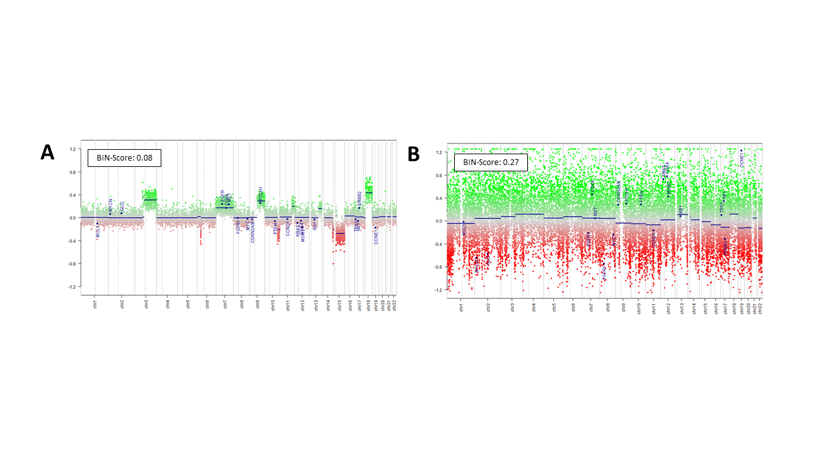

# DNAm-qc-scores

Here, we present three quality control scores (QC-Scores) for evaluating the quality of DNA methylation raw data from Illumina-based BeadChip arrays.  We suggest following cut-offs for the QC-Scores, which represent no biologically defined thresholds but are rather suggestions based on our experience.  

| QC-Score |     Cut-off          | Interpretation |
|:---------	|:------------------	|:---------------------|
| DB-Score 	| <1 		| A DB-Score above 1 indicates a deviation of the bimodal distribution of beta values and thus a technical problem or a possible biological background. |
| BIN-Score	| < 0.25 		| A BIN-Score above 0.25 is an indication of a technical error or a problem with the DNA itself. |
| CM-Score high and low | < 20% | Describe the percentage of deviant CpGs within the stable methylated loci and indicates a technical error or a problem with the DNA itself. |
| CM-Score difference | < 20% | Describes the differences between the HL-Scores high and low. A high difference is a measurement of a possible meaningful background. |

## DB-Score
In order to identify samples with a doubtful quality we mathematically summarized the overall DNA methylation distribution in the so called Distribution-Score (DB-Score). The DB-Score is defined as the ratio between the count of CpGs with beta values falling within the range of 0.3 to 0.7 and the count of CpGs with beta values less than or equal to 0.3 or greater than or equal to 0.7. The DB-Score can be calculated using the db.score() function.

**Figure Histograms:** Outstanding examples of samples with good (left), doubtful (middle) and bad (right) quality based on their DB-Scores.

>db.score(input)
>- input: Name of the table including one column with the TargetID followed by the beta values (samples are listed per column)
>
### Example
db.score(input = data)

## BIN-Score
As a second measure, we established an additional QC-Score, termed BIN-Score. The computation of the BIN-Score relies on the utilization of the R package "conumee," which facilitates CNV calling through the analysis of DNA methylation data. This score uses the distribution of the intensity values across defined genomic fragments as a measure for good or questionable quality. The genome is segmented into fragments, termed bins, each delineated by a specified minimum size and a requisite minimum number of CpGs. These bins, represented as points in the plot, serve to visually capture gains and deletions across the entire genome, shifting the segment line to the positive (gain) or negative (loss) along the y-axis. It is pertinent to note that the BIN-Score does not solely account for samples from malignant tissue, where CNVs are predominantly expected. Instead, the calculation relies on the distribution span of the bins along the segment line and the y-axis, rather than the CNVs per se. Consequently, substantial deviations of the points from their respective segments are indicative of technical variation, potentially induced by suboptimal DNA quality. The BIN-Score is calculated using the cnv.score() function. Tables including the ranges of the bins for EPIC and 450k are needed for calculation and are provided in the corresponding folder.

**Figure CNV-Plots:** Outstanding examples of samples with good (A) and bad (B) BIN-Scores.

>bin.score(input, array_type)
>
>- input: A Mset containing methylated and unmethylated signals (preferably generated with the minfi package). Reference samples must have "Control" in their name.
>- array_type: Choose "EPIC" or "450k"

### Example
bin.score(input = Mset, array_type = "450k")

## CM-Scores
As a further indication for a possible meaningful biological background, three scores were conducted based on highly consistent DNA methylation levels at specific CpGs (CM-Scores). Therefore, CpG loci with a constant DNA methylation pattern across diverse tissues, various cancers, non-malignant samples, and distinct sample preparation methods were identified. These stable CpG loci were further categorized into highly methylated CpGs (beta value > 0.9; 450k: 279, EPIC: 249), and lowly methylated CpGs (beta value < 0.1; 450k: 313, EPIC: 299). On the basis of the stable loci we calculated three scores: "CM-Score low" based on the lowly methylated stable CpGs; "CM-Score high" based on the highly methylated stable CpGs; and "CM-Score difference" representing the absolute difference between CM-Score high and low. All three scores are calculated using the hl.score() function. A list including the stable loci is needed for the calculation and provided in the corresponding folder. 

**Figure Heatmap-Lanes:** Stable loci across various samples (n=465). CpGs are listed per row, samples are listed per column.

> cm.score(input)
> 
>- input: Name of the table including one column with the TargetID followed by the beta values (samples are listed per column)
>
### Example
cm.score(input = data)
